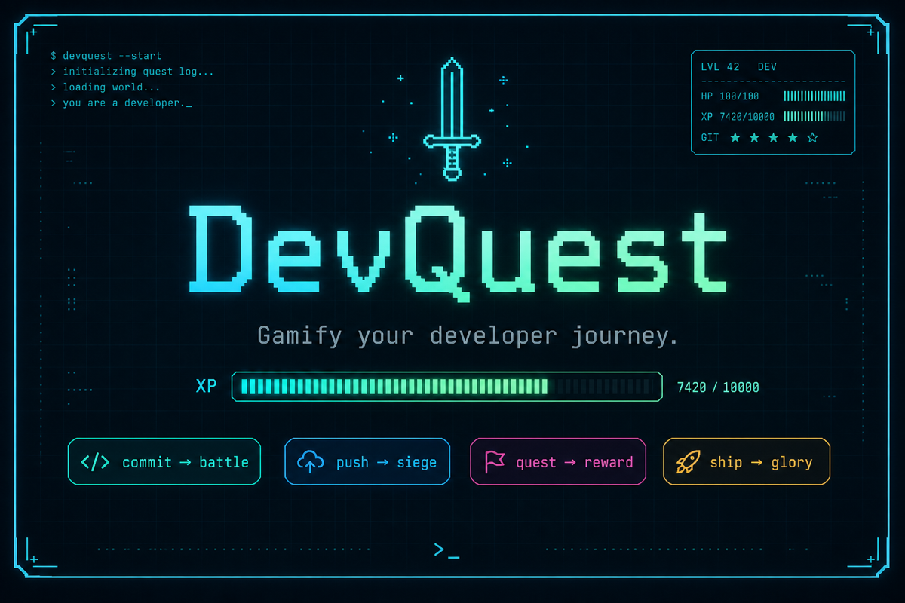

<p align="center">
  
</p>

<p align="center">
  <strong>DevQuest is not a Git wrapper.</strong><br/>
  It is a terminal RPG where programming <em>is</em> the gameplay.
</p>

<p align="center">
  <a href="https://pypi.org/project/devquest/"></a>
  <a href="https://pypi.org/project/devquest/"></a>
  <a href="LICENSE"></a>
  
  
</p>

---

## The world

```text
  Git is a sword.
  Deploy is a battle.
  Bug is an enemy.
  Merge Conflict is a boss.
```

Every real developer action becomes a quest. XP and Gold only drop when the work actually lands.

---

## Install

```bash
pip install devquest
```

Then awaken your hero:

```bash
hero init
```

---

## Gameplay loop

```text
┌─────────────────────────────────────────────────────────────┐
│  hero commit                                                │
│                                                             │
│  ╭─────────────────────╮                                    │
│  │ Prepare for battle! │                                    │
│  ╰─────────────────────╯                                    │
│                                                             │
│  Merge Conflict                                             │
│  HP [████████████░░░░░░░░] 48/80                            │
│                                                             │
│  Attack 1 ━━━━━━━━━━━━━━━━━━━━━━━━━━━━━━━━━━━━━━━━ 100%     │
│  CRITICAL HIT! 42 damage!                                   │
│                                                             │
│  ╭──────────────────────────────╮                           │
│  │ Victory!                     │                           │
│  │ Enemy Defeated: Merge Conflict│                          │
│  │ +40 XP   +20 Gold            │                           │
│  ╰──────────────────────────────╯                           │
│                                                             │
│  ╭──────────────────────────────╮                           │
│  │ LEVEL UP!                    │                           │
│  │ Level 5 · Bug Hunter         │                           │
│  ╰──────────────────────────────╯                           │
└─────────────────────────────────────────────────────────────┘
```

```text
hero push   →  siege the fortress (origin/<branch>)
hero status →  XP bar, title, equipped gear, quests
hero quests →  daily missions that reset with the sun
```

---

## Commands

| Command | What happens |
|---|---|
| `hero init` | Create your hero profile |
| `hero status` | Sheet: level, XP bar, gold, gear |
| `hero commit` | Battle an enemy, then commit |
| `hero push` | Assault the remote fortress |
| `hero achievements` | Trophy hall |
| `hero quests` | Daily quest board |
| `hero inventory` | Cosmetic loot (`--equip <key>`) |
| `hero shop` | Spend gold (`--buy <key>`) |
| `hero dashboard` | Full Textual menu (arrows + `q`) |

---

## Progression

```text
Titles
  Code Apprentice  →  Bug Hunter  →  Senior Warrior  →  Legendary Engineer

Combat
  Hit · Miss · Critical · Boss encounters

Economy
  Gold from real commits/pushes → cosmetic shop only
  (no pay-to-win, ever)
```

---

## Quick start

```bash
pip install devquest
cd your-repo
hero init
hero status
hero commit
hero push
hero dashboard
```

Local development:

```bash
pip install -e .
```

---

## Philosophy

> The terminal should feel like a game world.  
> Programming should feel like an adventure.

Read more in [`vision.md`](vision.md).

---

## Docs

| File | Purpose |
|---|---|
| [`vision.md`](vision.md) | Product vision |
| [`ROADMAP.md`](ROADMAP.md) | Release plan |
| [`CONTRIBUTING.md`](CONTRIBUTING.md) | How to contribute |
| [`PUBLISH.md`](PUBLISH.md) | PyPI release guide |

---

<p align="center">
  <sub>⚔ May your builds be green and your merges conflict-free.</sub>
</p>
